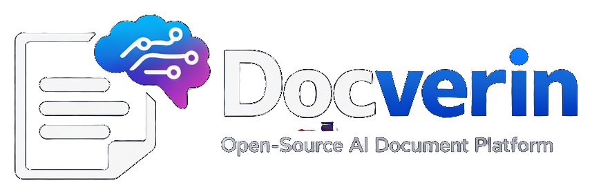

<p align="center">
  
</p>

<h1 align="center">Docverin</h1>

<p align="center">
  <strong>Open-source Laravel AI knowledge assistant for document indexing, semantic search, and citation-based answers.</strong>
</p>

<p align="center">
  Upload documents, process them in the background, retrieve relevant context, and chat with your knowledge base using source-aware answers.
</p>

---

## Overview

Docverin is an open-source application built with Laravel for teams and developers who want to turn documents into a usable AI knowledge layer.

The goal is simple: upload documents, process them into searchable chunks, retrieve the most relevant context, and generate answers that point back to the source material.

This project is designed as a real product-style codebase rather than a thin LLM wrapper. It focuses on practical architecture, observability, and a clean foundation for future extensions such as multi-provider support, background indexing pipelines, and citation-aware chat workflows.

---

## Core idea

Docverin combines several important layers into one app:

- document upload and organization
- background document processing
- semantic retrieval
- citation-aware chat responses
- workspace-based knowledge separation
- model and provider configuration
- token and cost observability

---

## Planned features

### Foundation
- User authentication
- Workspace management
- Document upload
- Document status tracking
- Clean dashboard and document views

### Processing pipeline
- Text extraction from `.txt`, `.md`, and `.pdf`
- Chunking documents into smaller retrieval units
- Embeddings generation
- Background indexing with queues
- Processing logs and failure states

### AI retrieval and chat
- Semantic search across indexed chunks
- Chat sessions per workspace
- Context-aware answer generation
- Citation mapping between answers and source chunks
- Prompt and model settings

### Observability
- Token usage tracking
- Estimated AI cost tracking
- Latency measurements
- Processing run history

### Future extensions
- Multiple AI providers
- Feature flags for retrieval strategies
- Realtime streaming responses
- Connectors for external sources
- Admin analytics and evaluation tools

---

## Tech stack

### Backend
- Laravel 13
- PHP 8.4
- PostgreSQL
- Redis
- Horizon
- Reverb
- Laravel AI SDK

### Frontend
- Inertia.js
- React
- TypeScript
- Tailwind CSS

---

## Current architecture direction

```text
app/
├── Http/
│   ├── Controllers/
│   └── Requests/
├── Jobs/
├── Models/
├── Services/
└── Support/
```

As the project grows, the AI-specific layer will be expanded into dedicated retrieval, prompt, citation, and orchestration modules.

---

## Initial domain model

### Workspace
A container for documents, chats, and AI settings.

### Document
Represents an uploaded file and its processing state.

### DocumentChunk
Represents a searchable chunk derived from a document.

### ChatSession
A conversation inside a workspace.

### ChatMessage
A single user or assistant message.

### Citation
A link between an answer and the source chunk(s) used to support it.

### ProviderSetting
Workspace-level AI configuration.

---

## Document lifecycle

A document is expected to move through statuses such as:

- `uploaded`
- `extracting`
- `chunking`
- `embedding`
- `indexed`
- `failed`

This makes the processing pipeline easier to monitor and debug.

---

## Project goals

Docverin is meant to demonstrate:

- practical Laravel architecture
- real-world AI integration
- background processing workflows
- retrieval-augmented generation patterns
- source-aware answer generation
- production-style project structure

This repository is also intended to become a strong portfolio piece for open source, engineering discussions, and technical interviews.

---

## Status

Docverin is currently in early setup and foundation stage.

The first milestone focuses on:

- auth scaffold
- workspace CRUD
- document upload
- storage integration
- status tracking

---

## Local development

### 1. Clone the repository

```bash
git clone https://github.com/your-username/docverin.git
cd docverin
```

### 2. Install dependencies

```bash
composer install
npm install
```

### 3. Configure environment

```bash
cp .env.example .env
php artisan key:generate
```

Update your `.env` with database, Redis, and broadcasting settings.

### 4. Run migrations

```bash
php artisan migrate
```

### 5. Start the application

```bash
php artisan serve
npm run dev
```

If you use queues and realtime locally, also run:

```bash
php artisan horizon
php artisan reverb:start
```

---

## Roadmap

### v0.0.1
- project foundation
- auth
- workspace CRUD
- document upload

### v0.0.2
- text extraction
- chunking
- processing jobs

### v0.0.3
- embeddings
- semantic retrieval
- chat sessions
- citations

### v0.1.0
- observability
- polished UI
- improved README
- screenshots and public release

---

## Why this project exists

A lot of Laravel + AI examples stop at a basic prompt call.

Docverin aims to go further by showing how to build an actual product-oriented AI application with a clean backend, asynchronous processing, and source-grounded answers.

---

## License

MIT
